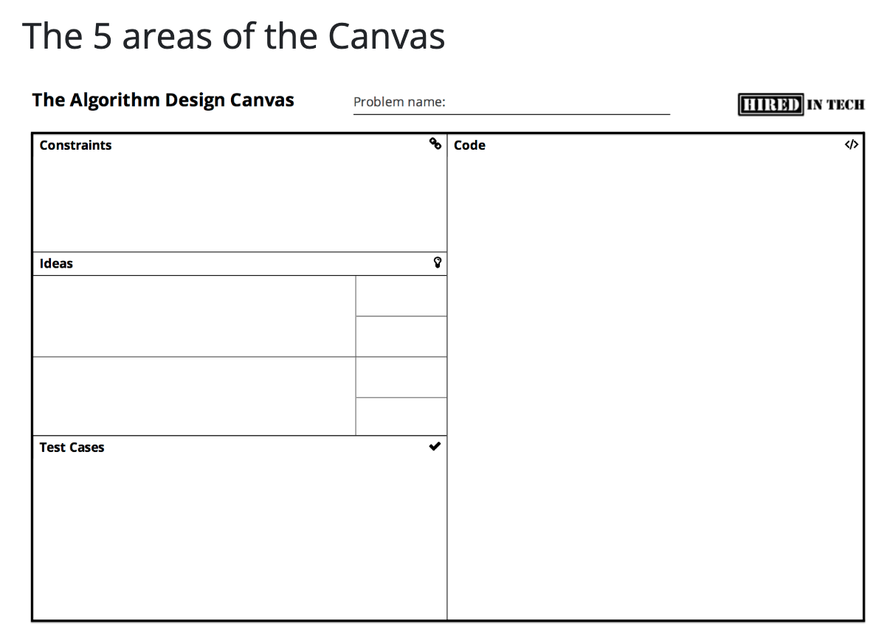

# write-and-learn-algorithms
쓰면서 익히는 알고리즘과 자료구조 스터디 with Python



# 알고리즘 설계 캔버스 (Algorithm Design Canvas)

HiredInTech에서 제공하는 **알고리즘 설계 캔버스**는 문제를 체계적으로 분석하고 해결하는 데 도움을 주는 강력한 도구입니다. 아래는 캔버스의 각 영역에 대한 설명입니다.

---

## **영역 #1: 제약 조건 (Constraints)**
이 영역에서는 문제의 **모든 제약 조건**을 정리합니다. 예를 들어, 다음과 같은 내용을 포함할 수 있습니다:
- 입력 배열의 최대 크기
- 입력 문자열이 유니코드 문자를 포함할 수 있는지 여부
- 로봇이 미로에서 대각선으로 움직일 수 있는지 여부
- 그래프에 음수 간선이 포함될 수 있는지 여부

**분석의 첫 단계**는 관련된 모든 제약 조건을 파악하여 이 영역에 작성하는 것입니다.

---

## **영역 #2: 아이디어 (Ideas)**
제약 조건을 파악한 후에는 **아이디어 생성 단계**로 넘어갑니다. 일반적으로 면접 중에는 1~3개의 아이디어를 논의합니다. 처음에는 하나의 아이디어로 시작하여 면접관에게 설명한 뒤, 더 나은 아이디어로 이동하는 경우가 많습니다.

여기에는 **아이디어에 대한 간결한 설명**을 작성합니다. 설명은 짧고 명확하게 작성하여 누구든 쉽게 이해할 수 있도록 해야 합니다.

---

## **영역 #3: 복잡도 (Complexities)**
각 아이디어에는 **시간 복잡도**와 **메모리 복잡도**를 분석하는 별도의 영역이 있습니다. 설명한 알고리즘마다 두 가지 복잡도를 추정할 수 있어야 합니다.  
**시간 vs 메모리 트레이드오프**는 알고리즘 설계 문제에서 핵심적인 요소입니다.

---

## **영역 #4: 코드 (Code)**
문제의 제약 조건을 정의하고, 몇 가지 아이디어를 논의하며, 복잡도를 분석하고 나면, 구현할 가치가 있다고 생각되는 알고리즘에 대해 코드를 작성합니다.

면접에서 **코드 작성 방식**은 IDE에서 작성하는 것과는 근본적으로 다릅니다. 면접 코딩에 대한 접근 방법은 아래 링크를 참고하세요.

---

## **영역 #5: 테스트 (Tests)**
마지막으로 **테스트 케이스를 작성하고 코드 테스트**를 진행합니다. 많은 사람들이 이 단계를 무시하지만, 이는 매우 비효율적인 방법입니다. 좋은 테스트와 나쁜 테스트를 구분하는 방법을 배우세요.

---

## **사용 방법**
이 프로세스를 면접 준비나 문제 풀이 과정에서 꾸준히 따라간다면, 대부분의 지원자들보다 한 발 앞서 나갈 수 있습니다. **다음에 무엇을 해야 할지 막막해하지 않고, 체계적인 설계 과정을 따라갈 수 있습니다.**

---

## **출력 및 활용**
캔버스가 유용하다고 생각되면, 몇 장을 출력하여 준비에 활용하세요. 이를 통해 알고리즘 설계 과정에서 더 효과적으로 문제를 해결할 수 있을 것입니다.

[Algorithm Design Canvas 인쇄하기](https://hiredintech.com/algorithms/algorithm-design-canvas/what-is-the-canvas/)


# 복잡도 (Complexity)

알고리즘을 설계할 때, 복잡도는 매우 중요한 개념입니다. 복잡도는 주어진 알고리즘의 효율성을 평가하는 기준으로, **시간 복잡도(Time Complexity)**와 **공간 복잡도(Space Complexity)**의 두 가지로 나뉩니다. 아래는 이 두 가지 개념에 대한 자세한 설명입니다.

---

## **1. 시간 복잡도 (Time Complexity)**
시간 복잡도는 **알고리즘이 실행되는 데 걸리는 시간**을 입력 크기와의 관계로 나타낸 것입니다. 시간 복잡도를 표현하는 대표적인 표기법은 다음과 같습니다:

- **O(1)**: 상수 시간 (Constant Time)  
  입력 크기에 관계없이 항상 일정한 시간이 걸리는 경우.
  ```python
  def get_first_element(array):
      return array[0]
  ```
  
- **O(log n)**: 로그 시간 (Logarithmic Time)  
  입력 크기가 증가해도 처리 시간이 느리게 증가하는 경우 (예: 이진 탐색).
  ```python
  def binary_search(array, target):
      # 이진 탐색 알고리즘
  ```

- **O(n)**: 선형 시간 (Linear Time)  
  입력 크기에 비례하여 시간이 증가하는 경우 (예: 배열의 모든 요소 순회).
  ```python
  def find_max(array):
      max_value = array[0]
      for num in array:
          if num > max_value:
              max_value = num
      return max_value
  ```

- **O(n^2)**: 이차 시간 (Quadratic Time)  
  중첩 루프가 있는 경우 (예: 버블 정렬).
  ```python
  def bubble_sort(array):
      for i in range(len(array)):
          for j in range(len(array) - i - 1):
              if array[j] > array[j + 1]:
                  array[j], array[j + 1] = array[j + 1], array[j]
  ```

- **O(2^n)**: 지수 시간 (Exponential Time)  
  입력 크기가 증가할수록 시간이 급격히 증가하는 경우 (예: 피보나치 수열 재귀 구현).
  ```python
  def fibonacci(n):
      if n <= 1:
          return n
      return fibonacci(n - 1) + fibonacci(n - 2)
  ```

---

## **2. 공간 복잡도 (Space Complexity)**
공간 복잡도는 **알고리즘이 실행되는 동안 사용하는 메모리 양**을 입력 크기와의 관계로 나타낸 것입니다. 다음은 공간 복잡도를 결정하는 주요 요소입니다:

### **1) 고정 공간 (Fixed Part)**  
알고리즘에서 입력 크기와 무관하게 고정적으로 사용하는 공간입니다.  
예: 변수, 상수, 프로그램 코드 자체.

### **2) 가변 공간 (Variable Part)**  
입력 크기에 따라 동적으로 변하는 공간입니다.  
예: 배열, 재귀 호출 스택, 동적 데이터 구조.

### **공간 복잡도 예시**
- 재귀 함수의 경우, **호출 스택 공간**이 중요한 공간 복잡도의 요소가 됩니다.
  ```python
  def factorial(n):
      if n == 0:
          return 1
      return n * factorial(n - 1)
  ```
  위 코드는 `O(n)`의 공간 복잡도를 가집니다 (스택 프레임 사용).

---

## **3. 시간 vs 공간 트레이드오프 (Time vs Space Trade-off)**
시간 복잡도와 공간 복잡도 사이에는 **트레이드오프**가 존재합니다. 특정 알고리즘은 더 많은 메모리를 사용하여 실행 시간을 줄이거나, 더 적은 메모리를 사용하여 실행 시간이 증가할 수 있습니다.

### **예시: 캐싱**
- **시간 최적화**: 메모리를 사용해 이전 계산 결과를 저장하는 방법 (예: 다이나믹 프로그래밍).
- **공간 최적화**: 계산 결과를 저장하지 않고 필요할 때마다 재계산.

---

## **복잡도 평가 팁**
1. **시간 복잡도 분석**: 입력 크기가 커질 때 실행 시간이 어떻게 변하는지 예측합니다.
2. **공간 복잡도 분석**: 메모리 사용량이 입력 크기와 어떤 관계를 가지는지 파악합니다.
3. **트레이드오프 고려**: 주어진 문제에서 시간과 공간 중 어떤 자원이 더 중요한지 결정합니다.


# 캔버스 작성 전 주의 사항

캔버스를 작성하기 전에 아래의 사항을 숙지하고 신중히 접근하세요.

---

## **1. 코딩하기 전에 조금 더 고민하자.**
문제를 충분히 이해하지 않고 바로 코딩에 들어가지 않도록 주의하세요. 시간을 들여 문제를 분석하고 최적의 접근 방식을 고민하는 것이 중요합니다.

---

## **2. 변수 이름을 명확하고 알맞게 정의하자.**
가독성과 유지보수성을 높이기 위해 변수 이름은 명확하고 의미 있게 정의해야 합니다. 예를 들어, `a`보다는 `array_length` 같은 이름을 사용하는 것이 좋습니다.

---

## **3. 작은 단위의 논리적 조각으로 분해하자.**
문제를 **작은 논리적 조각**으로 분해하고 각 부분을 독립적으로 분석하세요. 이렇게 하면 복잡도를 줄이고 코드가 다른 코드와 섞이는 것을 방지할 수 있습니다.

---

## **4. 작성한 코드를 여러 번 검토하자.**
코드를 작성한 후에는 스스로가 작성한 코드를 보고 **어떻게 수행될지 머릿속으로 시뮬레이션**하는 습관을 들이세요. 이는 코드 품질을 개선하는 데 큰 도움이 됩니다.


# PythonTutor: 온라인 코드 비주얼라이저

[PythonTutor](https://pythontutor.com/)는 코드를 시각적으로 분석할 수 있는 온라인 도구입니다.  
코드 실행 과정을 단계별로 확인하며, 변수와 데이터 구조의 변화 과정을 실시간으로 볼 수 있습니다.

Python을 비롯해 Java, JavaScript, C, C++, TypeScript 등 다양한 언어를 지원합니다.

